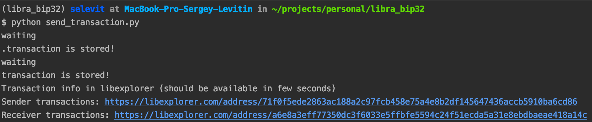

# Libra BIP32

An example how to derive new Libra address from master public key
and then send coins from this address.
I spent quite a lot of time to make it work, so just sharing.
All the stuff is in the [send_transaction.py](send_transaction.py).
Feel free to ping me for any questions.

## What is this for?

Libra uses ed25519 scheme for transaction signing.
Most libra wallet implementations use HKDF scheme for derivation of “children” private keys.
But HKDF doesn’t give you a way to use a master public key for addresses generation (like e.g. BIP32).

There is [an article](https://cardanolaunch.com/assets/Ed25519_BIP.pdf) written by Dmitry Khovratovich and Jason Law
Describing the way how to use the BIP32 derivation scheme within ed25519.
They created [the implementation](https://github.com/vbmithr/ocaml-bip32-ed25519) of their algorithm in Ocaml.

The other brave guy [ported this to Python](https://github.com/superdarkbit/nano-bip32-ed25519/tree/master/python_equivalents) (with custom Blake2b hash-function):
It looks not very "pythonic" but I didn't find any different alternative.
I've vendored it and changed the hash function to SHA512 to make it compatible with "normal" ed25519.

## Usage (tested on python 3.7)

```bash
pip install pipenv
git clone https://github.com/selevit/libra_bip32
cd libra_bip32
pipenv install
pipenv shell
python send_transaction.py
```

Expected result:


